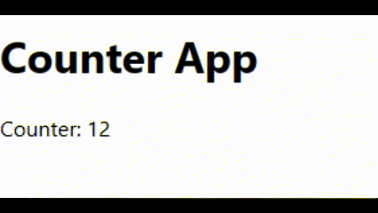

# Ejercicios de práctica
## Importante
Todas las entregas deben realizarse en el foro de tarea correspondiente en el campus de inove, salvo especificarse lo contrario.

## Preparar nuestro entorno de trabajo
Para poder realizar este ejercicio ya cuenta con el proyecto creado en esta carpeta de "ejercicios_practica". Utilizará esta carpeta para desarrollar todos los desafios de esta carpeta. Debe posicionar su terminal/consola dentro de la carpeta e instalar las dependencias antes de empezar:

`npm install`

## Consigna CounterApp: 
Implementar un componente llamado "CounterApp" que muestre un contador en pantalla. El contador debe comenzar en 0 y aumentar en 1 cada segundo. Además, se debe utilizar el hook useEffect para asegurar que el intervalo se inicie cuando el componente se monte y se detenga cuando el componente se desmonte.

Pasos para guiarte:

1. Crea un nuevo archivo llamado "CounterApp.jsx".

2. Importa los siguientes módulos y funciones necesarias en el archivo:

```
import  { useState, useEffect } from 'react';
```

3. Define la función de componente "CounterApp" como un componente funcional de React.
4. Dentro de la función "CounterApp", utiliza el hook useState para crear una variable de estado llamada "counter" y su función "setCounter". Inicializa el contador en 0.
5. A continuación, utiliza el hook useEffect para manejar el inicio y la detención del intervalo. El useEffect acepta una función de efecto y un array de dependencias vacío ([]), lo que significa que el efecto se ejecutará solo una vez, cuando el componente se monte.
6. Dentro de la función de efecto, crea una variable llamada "interval" utilizando la función setInterval(). Esta variable almacenará el ID del intervalo para poder detenerlo más tarde. Agrega 1000 al tiempo de ejecucion de setInterval().
7. Dentro de la función setInterval, utiliza la función "setCounter" para incrementar el contador en 1. Puedes hacerlo utilizando la sintaxis de función de actualización proporcionada por useState, que recibe el valor anterior del contador como argumento.
8. Fuera de la función setInterval, utiliza la declaración "return" para especificar la función de limpieza. En este caso, la función de limpieza debe detener el intervalo utilizando la función clearInterval y pasando el ID del intervalo:

```
return () => {
  clearInterval(interval);
};
```

9. Finalmente, dentro del componente "CounterApp", devuelve el JSX que represente la interfaz de usuario. En este caso, muestra un encabezado y el valor del contador:

```
return (
  <div>
    <h1>Counter App</h1>
    <p>Counter: {counter}</p>
  </div>
);
```

10. No te olvides de exportar el componente "CounterApp".

Una vez completados estos pasos, deberías tener un componente funcional de React llamado "CounterApp" que muestra un contador en pantalla. El contador aumentará en 1 cada segundo y se detendrá cuando el componente se desmonte. Esto les permitirá practicar el uso del hook useEffect, comprender cómo se montan y desmontan los componentes en React.

## Resultado final

