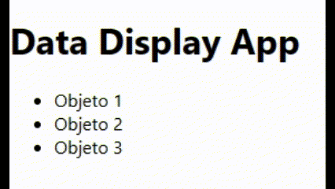

# Ejercicios de práctica
## Importante
Todas las entregas deben realizarse en el foro de tarea correspondiente en el campus de inove, salvo especificarse lo contrario.

## Preparar nuestro entorno de trabajo
Para poder realizar este ejercicio ya cuenta con el proyecto creado en esta carpeta de "ejercicios_practica". Utilizará esta carpeta para desarrollar todos los desafios de esta carpeta. Debe posicionar su terminal/consola dentro de la carpeta e instalar las dependencias antes de empezar:

`npm install`

## Consigna "DataDisplay":

Implementar un componente llamado "DataDisplay" que muestre una lista de datos en pantalla. El componente debe simular una carga de datos asincrónica utilizando el hook useEffect. Durante la carga de datos, se debe mostrar un mensaje de "Loading..." y, una vez cargados los datos, se debe mostrar la lista de objetos con su respectivo nombre.

Pasos para guiarte:

1. Crea un nuevo archivo llamado "DataDisplay.jsx".
2. Importa los siguientes módulos y funciones necesarias en el archivo:

```
import { useState, useEffect } from 'react';
```

3. Define la función de componente "DataDisplay" como un componente funcional de React
4. Dentro de la función "DataDisplay", utiliza el hook useState para crear una variable de estado llamada "data" y su función "setData". Inicializa los datos como un array vacío.
5. A continuación, utiliza el hook useEffect para simular la carga de datos asincrónica. El useEffect acepta una función de efecto y un array de dependencias vacío ([]), lo que significa que el efecto se ejecutará solo una vez, cuando el componente se monte.
6. Dentro de la función de efecto, define una función asincrónica llamada "fetchData". Esta función simulará la carga de datos y se encargará de actualizar el estado de "data" una vez que los datos estén disponibles.
7. Dentro de la función "fetchData", utiliza la función "await" y la función "setTimeout" para simular una carga de datos de 2 segundos. Esto permite simular una llamada a una API o una operación asincrónica.

```
await new Promise((resolve) => setTimeout(resolve, 2000));

```

8. Después de la simulación de carga de datos, crea una variable llamada "loadedData" que contenga los datos que deseas mostrar en la lista. En este ejemplo, se utiliza un array de objetos con propiedades "id" y "name":

```
const loadedData = [
  { id: 1, name: 'Objeto 1' },
  { id: 2, name: 'Objeto 2' },
  { id: 3, name: 'Objeto 3' },
];
```

9. Utiliza la función "setData" para actualizar el estado de "data" con los datos cargados.
10. Fuera de la función "fetchData" pero todavia dentro del useEffect, llama a la función "fetchData" para iniciar la carga de datos.
11. Finalmente, dentro del componente "DataDisplay", devuelve el JSX que represente la interfaz de usuario. En este caso, muestra un encabezado y la lista de objetos. Si el estado de "data" tiene una longitud mayor a cero, muestra la lista de objetos. De lo contrario, muestra un mensaje de "Loading..."
12. No te olvides de exportar el componente.

Una vez completados estos pasos, deberías tener un componente funcional de React llamado "DataDisplay" que muestra una lista de datos en pantalla. Durante la simulación de carga de datos, se mostrará un mensaje de "Loading..." y, una vez cargados los datos, se mostrará la lista de objetos con sus respectivos nombres. Esto les permitirá practicar el uso del hook useEffect y comprender cómo manejar la carga de datos asincrónica en React.

## Resultado final


